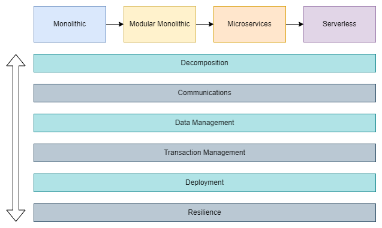

# Software Architecture <!-- omit in toc -->

## Contents <!-- omit in toc -->

- [1. Evolution of Software Architectures](#1-evolution-of-software-architectures)
  - [1.1. Monolithic to Serverless](#11-monolithic-to-serverless)
  - [1.2. Architecture Design Vertical Considerations](#12-architecture-design-vertical-considerations)
- [2. Way to Design Software Architecture](#2-way-to-design-software-architecture)
- [3. Common Software Architecture Design Problems](#3-common-software-architecture-design-problems)
  - [3.1. Increased Traffic, Handle More Request](#31-increased-traffic-handle-more-request)
  - [3.2. Break Down Application into Microservices](#32-break-down-application-into-microservices)
  - [3.3. Direct Client-to-Service Communication](#33-direct-client-to-service-communication)
  - [3.4. Inter-service communication makes](#34-inter-service-communication-makes)
  - [3.5. Chat with Support Agent](#35-chat-with-support-agent)
  - [3.6. Service-to-Service Communications Chain Queries](#36-service-to-service-communications-chain-queries)
  - [3.7. Long Running Operations Can't Handle with Sync Communication](#37-long-running-operations-cant-handle-with-sync-communication)
  - [3.8. Database Bottlenecks when Scaling, Different Data Requirements For Microservices](#38-database-bottlenecks-when-scaling-different-data-requirements-for-microservices)
  - [3.9. Cross-Service Queries and Write Commands on Distributed Scaled Databases](#39-cross-service-queries-and-write-commands-on-distributed-scaled-databases)
  - [3.10. Manage Consistency Across Microservices in Distributed Transactions](#310-manage-consistency-across-microservices-in-distributed-transactions)
  - [3.11. Handle Millions of Events Across Microservices](#311-handle-millions-of-events-across-microservices)
  - [3.12. Database operations are expensive, low performance](#312-database-operations-are-expensive-low-performance)
  - [3.13. Deploy Microservices at Anytime with Zero-downtime and flexible scale](#313-deploy-microservices-at-anytime-with-zero-downtime-and-flexible-scale)
- [4. Choosing the Right Architecture for your Application](#4-choosing-the-right-architecture-for-your-application)
  - [4.1. Design for Business Requirements](#41-design-for-business-requirements)
  - [4.2. -Ilities](#42--ilities)
- [5. Monolithic Architecture](#5-monolithic-architecture)
  - [5.1. What is Monolithic Architecture?](#51-what-is-monolithic-architecture)
  - [5.2. When to use Monolithic Architecture](#52-when-to-use-monolithic-architecture)
  - [5.3. Benefits of Monolithic Architecture](#53-benefits-of-monolithic-architecture)
  - [5.4. Challenges of Monolithic Architecture](#54-challenges-of-monolithic-architecture)
  - [5.5. Design principles - KISS, YAGNI, DRY](#55-design-principles---kiss-yagni-dry)
  - [5.6. Assessment Monolithic Architecture](#56-assessment-monolithic-architecture)
- [6. Layered (N-Layer) Architecture](#6-layered-n-layer-architecture)
  - [6.1. Components of a Layered Architecture](#61-components-of-a-layered-architecture)
  - [6.2. Design principles - Separation of Concerns (SoC)](#62-design-principles---separation-of-concerns-soc)
  - [6.3. Design principles - SOLID](#63-design-principles---solid)
  - [6.4. Layered Monolithic Architecture evolution](#64-layered-monolithic-architecture-evolution)
  - [6.5. Assessment Layered Monolithic Architecture](#65-assessment-layered-monolithic-architecture)
- [7. Clean Architecture](#7-clean-architecture)
  - [7.1. The Dependency Rule](#71-the-dependency-rule)
  - [7.2. Layers of Clean Architecture](#72-layers-of-clean-architecture)
  - [7.3. Benefits of Clean Architecture](#73-benefits-of-clean-architecture)
  - [7.4. Assessment Layered Monolithic Architecture](#74-assessment-layered-monolithic-architecture)
- [8. Vertical Slice Architecture](#8-vertical-slice-architecture)
- [9. MVC, MVP \& MVVM](#9-mvc-mvp--mvvm)

# 1. Evolution of Software Architectures

- Over the years, software development moved away from traditional **monolithic** architectures because of the complexities with tight coupled and interconnected code.
  - As a result, **microservices** are adopted many projects with using cloud native approaches that enable distributed computing through multiple smaller services.

## 1.1. Monolithic to Serverless

## 1.2. Architecture Design Vertical Considerations

# 2. Way to Design Software Architecture

# 3. Common Software Architecture Design Problems

## 3.1. Increased Traffic, Handle More Request

- **Problems**
  - Our E-Commerce Business is growing.
  - Need to handle greater amount of request per second.
  - Provide acceptable latency for users.
- **Solutions**
  - Scalabilitiy.
  - Vertical and Horizontal Scaling.
  - Scale Up and Scale Out.
  - Load Balancer.

## 3.2. Break Down Application into Microservices

- **Problems**
  - Our E-Commerce Business is growing.
  - Teams wants to agile and add new features immediately to compete the market.
  - Required Independent Scale and Deployments.
  - We should clearly identify microservices which parts could be independent scale and deploy.
- **Solutions**
  - Microservices Decomposition Patterns.

## 3.3. Direct Client-to-Service Communication

- **Problems**
  - Direct Client-to-Service Communication.
  - Cause to chatty calls from client to service.
  - Hard to manage invocations from client app.
- **Solutions**
  - Well-defined API Design.
  - Microservices Communication Patterns.

## 3.4. Inter-service communication makes

- **Problems**
  - Network performance issues on inter-service communication.
  - Backend Communication performance requirements.
  - Real-time communication requirements.
  - Streaming requirements.
- **Example Use Case**
  - Add Item into Shopping Cart that need to calculate with up-to-date discounts.
- **Solutions**
  - gRPCAPIs scalable and fast APIs.
  - Able to develop with different technologies with RPC framework.

## 3.5. Chat with Support Agent

- **Problems**
  - Business teams request to answer Customer queries by chatting with Support Agents.
  - Real-time communication requirements.
  - Sending/receiving messages in Chat window.
- **Example Use Case**
  - E-commerce Online Agent help customer preferences as per product features on website.
- **Solutions**
  - WebSocket APIs: Build real-time two-way communication applications.

## 3.6. Service-to-Service Communications Chain Queries

- **Problems**
  - HTTP calls to multiple microservices.
  - Chain Queries.
  - Visit more than a few microservices.
  - Increased latency.
- **Solutions**
  - Aggregate query operations.
  - Service Aggregator Pattern.

## 3.7. Long Running Operations Can't Handle with Sync Communication

- **Problems**
  - HTTP calls to multiple microservices.
  - Chain Queries.
  - Visit more than a few microservices.
  - Increased latency with Highly Coupling Services.
  - Performance, scalability, and availability problems.
- **Best Practices**
  - Minimize the communication between the internal microservices.
  - Make microservices communication in Asynchronous way as soon as possible.
- **Solutions**
  - Asynchronous Message-Based Communications.
  - Working with events.

## 3.8. Database Bottlenecks when Scaling, Different Data Requirements For Microservices

- **Problems**
  - Database are stateful service.
  - Scaling stateful services are not easy.
  - Vertical scaling has limits need to scale Horizontally.
  - Different Data Requirements For Microservices.
- **Solutions**
  - Scale Stateful Application Horizontal Scaling.
  - Service and Data Partitioning along Business Boundaries - Shards/Pods.
  - Use NoSQL Database to gain partitioning.
  - Identify Database Requirements following best practices.
- **Question**
  - How to Choose a Database for Microservices?

## 3.9. Cross-Service Queries and Write Commands on Distributed Scaled Databases

- **Considerations**
  - Cross-services queries that retrieve data from several microservices?
  - Separate read and write operations at scale?
- **Problems**
  - Cross-Service Queries with Complex JOIN operations.
  - Read and write operations at scale.
  - Distributed Transaction Management.
- **Solutions**
  - Microservices Data Query Pattern and Best Practices.
  - Materialized View Pattern.
  - CQRS Design Pattern.
  - Event Sourcing Pattern.

## 3.10. Manage Consistency Across Microservices in Distributed Transactions

- **Considerations**
  - Distributed Transactions that required to visit several microservices?
  - Consistency across multiple microservices?
  - Rollback transaction and run compensating steps?
- **Problems**
  - Distributed Transaction Management
  - Rollback Transaction on Distributed Environment
  - Run Compensate Steps if one of service fail
- **Solutions**
  - Microservices Distributed Transaction Management Pattern and Best Practices
  - Saga Pattern for Distributed Transactions
  - Transactional Outbox Pattern
  - Compensating Transaction pattern
  - CDC - Change Data Capture

## 3.11. Handle Millions of Events Across Microservices

- **Considerations**
  - What if we have thousands of microservices that need to communicates with millions of events?
  - If multiple subsystems must process the same events.
  - Required Real-time processing with minimum latency.
  - Required complex event processing, like pattern matching.
  - Required process high volume and high velocity of data, i.e. IoT apps.
- **Problems**
  - Decoupled communications for thousands of microservices.
  - Real-time processing.
  - Handle High volume events.
- **Solutions**
  - Event-driven architecture for microservices.

## 3.12. Database operations are expensive, low performance

- **Considerations**
  - Event-driven architecture comes with latency when publishing and subscribing events from the Event Hub.
  - Sync REST APIs communication make expensive calls to a database that reduce performance.
  - How can we make more faster that increase performance of communications in Microservices Architecture?
- **Problems**
  - Slowliness and Low Performance Communication.
  - Latency when publishing and subscribing events.
  - Rest APIs make Database calls that are expensive, low performance.
- **Solutions**
  - Distributed cache.
  - Storing frequently accessed data in a distributed cache.

## 3.13. Deploy Microservices at Anytime with Zero-downtime and flexible scale

- **Problems**
  - Business teams wants to add new features immediately.
  - Innovate and experiment with new features.
  - Deploy features immediately, not waiting for deployment dates.
  - Flexible scale for market peek times.
- **Considerations**
  - Ensure continuity of service and minimize disruption.
  - Allow for continuous delivery.
  - Support high-traffic environments.
- **Solutions**
  - Containers and Orchestrators.
  - Deployment strategies; blue-green deployment, rolling.
    deployment, and canary deployment.
  - Kubernetes Patterns; Sidecar Patterns, Service Mesh Pattern.
  - DevOps and CI/CD Pipelines and Infrastructure as code (IaC).

# 4. Choosing the Right Architecture for your Application

- Every Architecture has Pros and Cons
  - Understand that **every architecture** has **benefits** and also **drawbacks**.
  - Consider every architecture style as a SA (Software Architecture).
  - What is the Right Architecture for your Application?
    - **It Depends..**
- Monolithic Architecture and Microservice Architecture are **architectural patterns**.
- No architecture pattern **is better than other**.
- Design your system with focusing on **context** and **non-functional requirements** (-ilities)
- **WRONG:** Microservices > Monolithic

## 4.1. Design for Business Requirements

- Every **design decision** must be **justified** by a **business requirement**.
- **To avoid over-engineering** the application architectures, keep to drive design for business requirement.
- Engineers are **tend to be over-engineering** with latest architecture styles, use latest tools.
- It **becomes** an **experimental application** that use all latest fancy tools and architectures.
- We should clearly **define functional** and **nonfunctional** requirements.
- **Define** our **limits**, **constraints** and **assumptions** of the application and define business objectives clearly.
- **Start** and **Grow Application** with **Metrics**
  - How many Concurrent Users that our application handle?
  - What is the target of expected Requests/second Latency?
  - What level of application outage is acceptable?
- **Business requirements drive** these **design considerations**.

## 4.2. -Ilities

- Scalability
- Availability
- Reliability
- Maintainability
- Usability
- Eficiency
- Security
- Flexibility
- Performance

# 5. Monolithic Architecture

## 5.1. What is Monolithic Architecture?

- Traditional approach to software development.
- Developing a complete application as a **single unit**.
- Most of legacy applications are mainly implemented as a monolithic architecture.
- Developed **single codebase**.
- UI, Business and DB calls is in **same codebase**.
- All application ships with single big deployment with single jar/war/dll file.
- Can't say old style arcitecture, still valid for particular scenarios.
- **Advantages:** Easy to get start and debug.
- **Disadvantages:** Difficult to manage, Hard to implement new features.

## 5.2. When to use Monolithic Architecture

- If you are building small application, still monolithic architecture is one of the best architecture.
- They're straightforward to:
  - Build.
  - Test.
  - Deploy.
  - Troubleshoot.
  - Scale vertically (scale up).
  - **Simple to develop relative** to microservices.
  - **Easier to deploy** as only a single jar/war/dll file.
- **Others aspects**
  - **Small team at Founding Stage**
    - If you are a startup and your team is small like 2 to 5 members, you don't need to deal with the complexity of the high-overhead microservices architecture.
  - **Simple application with Predictable Scale and Complexity**
    - If your application doesn't require advanced scalability and the complexity is manageable, then a monolith architecture is the best option to start.
  - **Proof of Concept and Quick Launch**
    - Building a proof of concept, like testing a new idea on market, that means your new products will pivot and evolve a lot over time, when you figure out what will be useful to your users.
  - **No Microservices Expertise**
    - If your team has no prior experience with microservices architecture, that will really hard to ship your application effectively and timely.

## 5.3. Benefits of Monolithic Architecture

- **Simple to develop**
  - As long as the monolithic approach is a standard way of building applications, any engineering team has the right knowledge and capabilities to develop a monolithic application.
- **Easier debugging and testing**
  - Monolithic applications are much easier to debug and test.
  - Since a monolithic application has a single code base, we can run end to-end testing much faster.
- **Simple to deploy**
  - When it comes to monolithic applications, you do not have to handle many deployments, just one file or directory.
  - Easier to deploy as only a single jar/war/dll file is deployed.

## 5.4. Challenges of Monolithic Architecture

- **Become Complex over time - Hard to Understand**
  - It becomes too large in size with time and that's why its difficult to manage.
  - Application grows with adding new functionalities, a monolithic codebase can become extremely large and complex.
- **Hard to Making New changes**
  - It is harder to implement new changes in such a large and complex application with highly tight coupling.
  - Any code change affects the whole system.
- **Barrier to new technology adoption**
  - It is extremely problematic to apply a new technology because the entire application has to be re development due to the interlocking dependencies found in a monolith.
- **Difficult to Scale**
  - You can't scale components independently, the only option is the scaling the whole application. You can't scale individual components.

## 5.5. Design principles - KISS, YAGNI, DRY

[Design principles](<[https://](https://github.com/jeftegoes/SolidDesignPrinciplesOverviewAndExamples?tab=readme-ov-file#4-design-principles)>)

## 5.6. Assessment Monolithic Architecture

- **Benefits**
  - Easy Development.
  - Easy Debug and Test.
  - Easy to Deploy.
- **Drawbacks**
  - Highly tight coupling.
  - Hard to Splitting the code.
  - Violate Separation of concerns.
  - Interlocking Dependencies without Layers of isolation.
- **Solutions**
  - Separate UI, Business and Data Layers as logical layers.
  - Layered Architecture.
  - SOLID Design.

# 6. Layered (N-Layer) Architecture

- The layered architecture pattern is the most commonly used architecture pattern.
- Known as the **n-tier architecture style** or **the multi-layered architecture style**.
- Organize the components of an application with similar functionalities into **horizontal logical layers**.
  - Each layer performs a specific role within the application.
- Still using Monolithic architecture separating horizontal logical layers, components are interconnected but **don't depend** on each other. **(Attention point)**
- Organizing code for **separation of concerns (SoC)**.
- **Layers of isolation** that layers can be modified and the change won't affect other layers.

## 6.1. Components of a Layered Architecture

- **Presentation Layer**
  - Responsible for user interactions with the software system, for example, a web app.
- **Application/Business Layer**
  - Handles aspects related to accomplishing functional requirements including use case implementations.
- **Database Layer**
  - Responsible for handling data, databases, such as a SQL database.

## 6.2. Design principles - Separation of Concerns (SoC)

- **Separation of concerns(SoC)** is one of the core software design principle.
- Separation of concerns is a design principle for separating a computer program into **distinct sections**.
- **Isolate** the software application into separate sections, manages complexity by partitioning the software system.
- Distinguish between the concepts of layer and tiers with certain responsibilities.
- Elements in the software should be **unique**.
- Limits to allocate responsibilities.
- Low-coupling, high-cohesion.

## 6.3. Design principles - SOLID

[SOLID](https://github.com/jeftegoes/SolidDesignPrinciplesOverviewAndExamples)

## 6.4. Layered Monolithic Architecture evolution

## 6.5. Assessment Layered Monolithic Architecture

- **Benefits**
  - Easy Development, Debug and Deploy.
  - Horizontal Logical Layers.
  - Separation of Concerns.
- **Drawbacks**
  - Layers Dependent each other.
  - Highly Coupling.
  - Hard to maintanance.
  - Complexity of codebase.
  - Hard to Change libraries; i.e. Change orm tool with different library Requires to modify business layer.
- **Solutions**
  - Clean Architecture.
  - The Dependecy Rule.

# 7. Clean Architecture

- **Separates** the elements of a design **into circle levels**.
- **Clean architecture** was created by **Robert C. Martin** and promoted on his blog, **Uncle Bob**.
  - [The Clean Architecture by Robert C. Martin](https://blog.cleancoder.com/uncle-bob/2012/08/13/the-clean-architecture.html)
- Organize code with encapsulates the business logic.
- Keep the **core business logic** and application domain at the **center of the solution** structure that **independent** with presentation and data access layers.
- Clean architecture divided into **two main elements**:
  - **Policies:** They are the business rules and procedures
  - **Details (mechanisms):** They are the implementation code to carry out the policies
- Focus on the **policies** and **business logics** that build on project requirements
- The internal layers contains the business rules and has **not dependency** of any third-party library.

## 7.1. The Dependency Rule

- The dependencies of a source code can only **point inwards**.
  
- Code dependencies can only **move from the outer levels inward**.
  
- Code on the inner layers can **have no knowledge** of functions on the outer layers.
- Inner layer cannot **have any information** about elements of an outer layer.
- Classes, functions, variables, data format, or any entity declared in an **outer layer** must not be mentioned by the code of an inner layer.

## 7.2. Layers of Clean Architecture

- **Entities** or **Enterprise Business Rules**
  - It is includes plain domains and business rules.
  - In this layer we add objects or entities with **NO** framework and annotations.
- **Use Cases** or **Application Business Rules**
  - These layer include application business rules and decision making codes.
  - That means we develop our core business and application logic codes into this layer.
  - In this layer, we don't know who trigger or how the result will be presented.
  - However, based on the services, we keep business logic independent from the UI or database layers.
- **Interface adapters, controllers and gateways**
  - This layer is a communication layer that provides to **convert data desired format for storing into external source** like database file system, third parties, and so on.
- **Frameworks and drivers**
  - This is the implementation layer for infrastructure and external interfaces.
  - This is the most outer layer in this clean architecture, which changes frequently based on the technologies, for example, updating like database, web frontend frameworks and so on.
  - In this layer we have technology related codes that provide the actual implementation code to the UI layer and the database layer.

## 7.3. Benefits of Clean Architecture

- **Independent of Database and Frameworks**
  - The software is not dependent on an ORM or Database.
  - You can change them easily.
- **Independence of UI**
  - The UI can change easily, without changing the rest of the system and business rules.
- **Testable**
  - It is naturally testable. You can test business rules without considering UI, Database, Mock servers, etc.
- **Independence of any external agency**
  - In fact, your business rules simply don't know anything at all about the outside world.

## 7.4. Assessment Layered Monolithic Architecture

- **Benefits**
  - Easy Development, Debug and Deploy.
  - Loosely Coupled Independent Layers.
  - Flexible Logical Layers.
  - Testable and Independent changable to 3rd parties libraries.
- **Drawbacks**
  - Layers are independent but those are technical layers:
    - Domain, Infrastructure, Application and UI Layer
  - Vertical business logic implementation codes required to modify all layers: i.e. add to basket, checkout order use cases
- It is still Monolithic and has Scalability Issues
  - How many concurrent request can accommodate our design?
- **Solutions**
  - Scalabilitiy
  - Vertical and Horizontal Scaling
  - Scale Up and Scale Out
  - Load Balancer

# 8. Vertical Slice Architecture

# 9. MVC, MVP & MVVM

[MVC, MVP & MVVM](https://github.com/jeftegoes/DotnetArchitectureMvcMvpMvvm)
